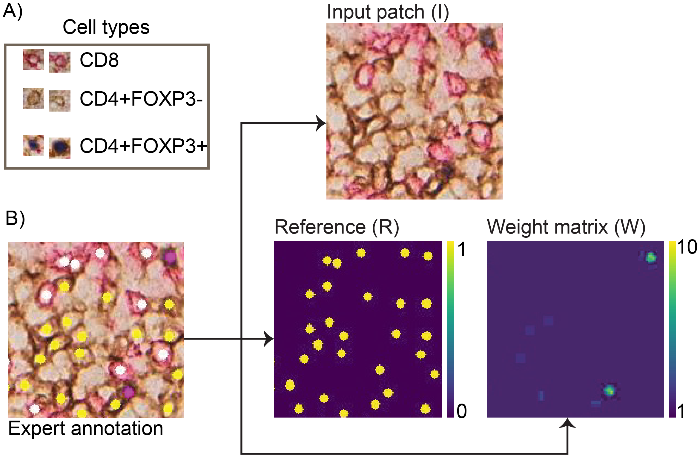
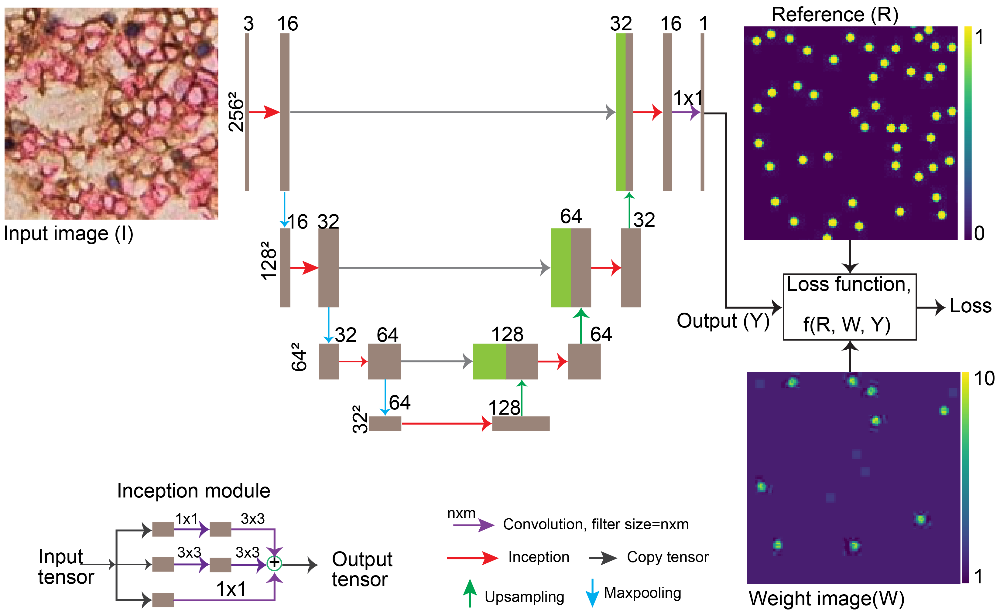
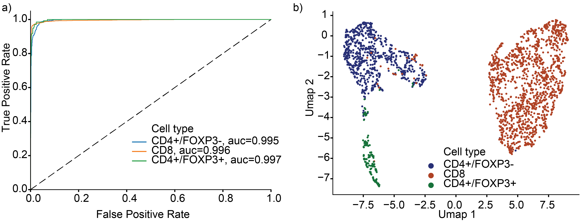

# AwareNet: Cell abundance aware deep learning for cell detection on highly imbalanced pathological data

## Description
In this work, we proposed a new class balancing approach in the context of single cell detection from single cell dot annotation.
Our work has the following contributions:
1) We implemented cell detection and classification deep learning framework that uses class balancing technique of Dice overlap in dataset with class imbalance.
2)We implemented an algorithm that generates cells
weight image from expert dot annotation based on the
relative abundance of cell types in the training data.
3) We implemented and compared performance of different
cell weighting strategies.

It is published in ISBI 20202 and the full manuscript is available [here](https://ieeexplore.ieee.org/document/9433994).

## Libraries required
- numpy==1.17.5
- scikit-image==0.16.2
- matplotlib==3.2.2
- opencv-python==4.1.2.30
- seaborn==0.10.1

## Running using Docker or Singularity image for running CONCORDe-Net
- Docker image: docker://yhagos/tf2gpu:concordenet
- See how to use them inside the cell detection (CD) and cell classification (CC) folders

## Training data preparation
 ""

## Implemetation flow chart

## Cell classification performance evaluation

## Citation
If you use AwareNet please include this ref: Y. B. Hagos et al., "Cell Abundance Aware Deep Learning For Cell Detection On Highly Imbalanced Pathological Data," 2021 IEEE 18th International Symposium on Biomedical Imaging (ISBI), 2021, pp. 1438-1442, doi: 10.1109/ISBI48211.2021.9433994. 

